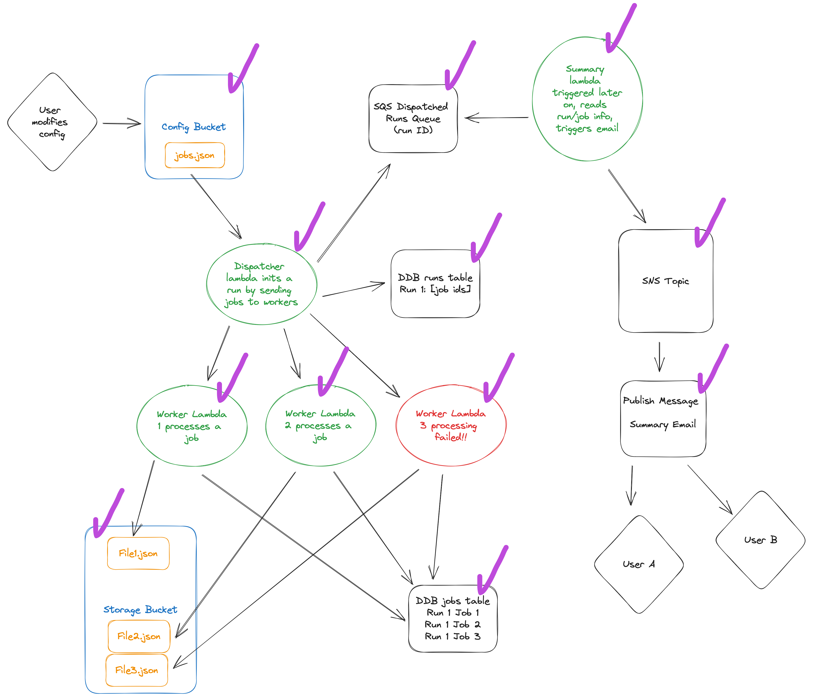

# sam-serverless-batch-job

This is an AWS SAM template that sets up an application which runs serverless batch processing. The purpose is to asynchronously batch process groups of tasks without needing to manage a server. Tasks must run within the Lambda runtime limit of 15 minutes or less.

## Architecture and Terminology

This sketch illustrates the app's architecture. I tried to strike the balance of keeping the app simple but also complete enough that it could see real use without too much more work. Let's break down the workflow.

A _Run_ is a configurable collection of _Jobs_. The _Run_ configuration is defined within a json file that is stored in the _Config Bucket_.

Invoking the _Dispatcher_ lambda triggers a _Run_ to begin. Currently the _Dispatcher_ lambda is using an API trigger to make it easier to test out, but realistically for this type of thing you will probably switch to a scheduled trigger.

The _Dispatcher_ lambda is responsible for a few things. First, it sends each _Job_ to a _Worker_ lambda to be processed. Next, it writes some info about the run to the _Runs_ db table. Lastly, it sends the dispatched run ID into a queue.

Each _Worker_ lambda processes its job and stores an output artifact in the _Artifacts Bucket_. It also writes some info about the job results to the _Jobs_ db table. Jobs must run within the lambda runtime limit of 15 minutes, so that must be kept in mind when configuring how the _Run's_ work is split between _Jobs_.

After one (or a few) run completes, you can invoke the _Summary_ lambda to get info about how it went. Since we are working within the lambda runtime limit of 15 minutes, you could for example schedule the _Summary_ lambda to run just after that. For now, it is using an API trigger for easy testing.

When the _Summary_ lambda is invoked, it will check to see if the queue contains any dispatched run ID's. If there are run ID's in the queue, a message will be published to SNS which will in turn send a notification email to any subscribers with the results of the run. The _Summary_ lambda will clear up to 10 runs from the queue each time it is invoked.

That's it! The intent was to make this a good starting point for serverless batch processing without cluttering it with too much placeholder business logic.

## Usage

In **samconfig.toml** set `EmailAddress` in `parameter_overrides` to the email that you want to subscribe to summary notifications.

Next, run `sam build` and then `sam deploy` to build and deploy the stack to your AWS account. Take note of the _Dispatcher_ and _Summary_ lambda endpoints that get printed to the terminal after the deploy completes. You'll also need to copy the **jobs.json** file to the config bucket that gets created.

You will get an email shortly after from **AWS Notifications** confirming that you want to subscribe for notifications.

Try out the app by hitting the endpoint URL for the `.../dispatch/` route to populate the queue with some runs. Then hit the `.../summary/` endpoint to trigger the summary email and clear the runs queue.
